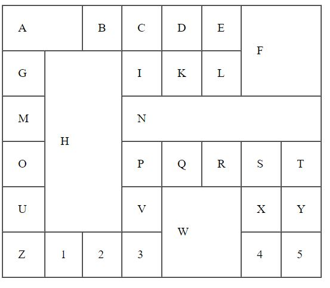
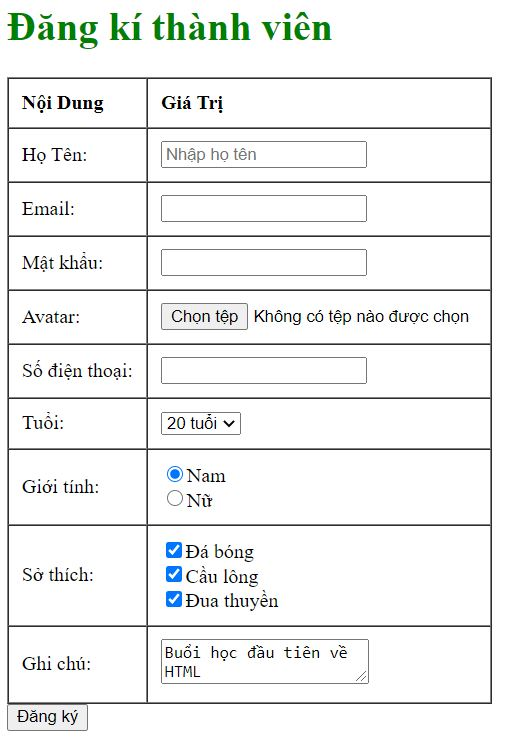

### Bài 1: Layout

- Tạo layout như hình trên (sử dụng table và các thuộc tính của thẻ table)
- Tìm hiểu cách làm cho viền của bảng thành 1 dòng như trong hình (Không cần css vẫn làm được mà hôm trước anh quên)

### Bài 2: Form

* Họ tên: hiển thị text gợi ý: nhập họ tên
* Email: bắt buộc phải nhập
* Phần avatar chỉ được chọn file image có đuôi png
* Số điện thoại tối đa 11 số
* Sở thích, chọn sẵn các lựa chọn như hình
***
### NOTE:
Chưa cần làm đẹp, nhìn giống là được
